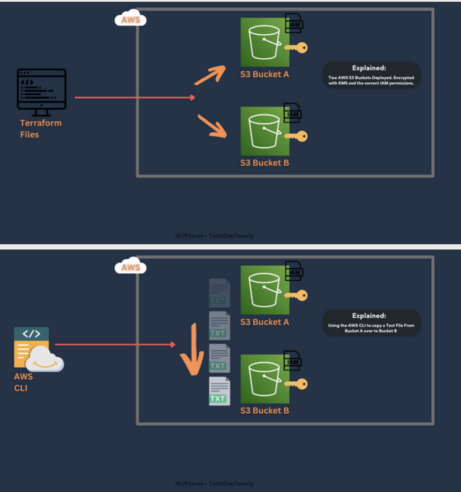
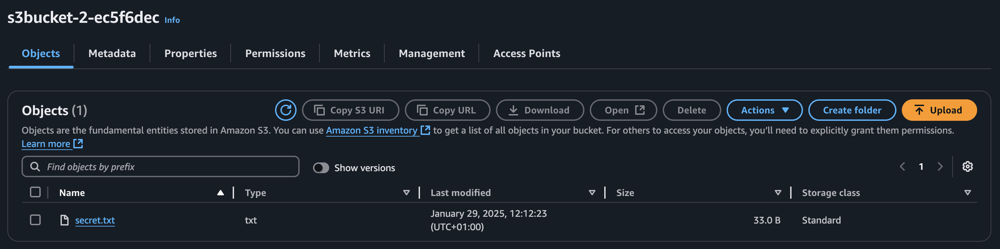
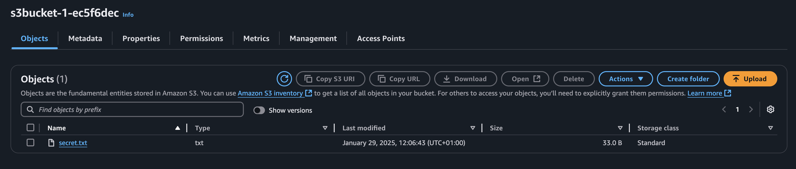
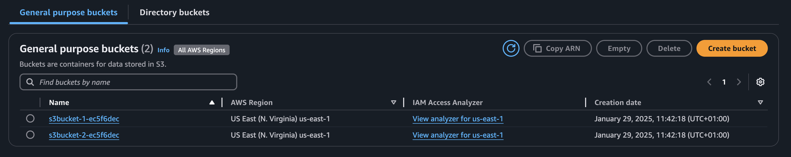
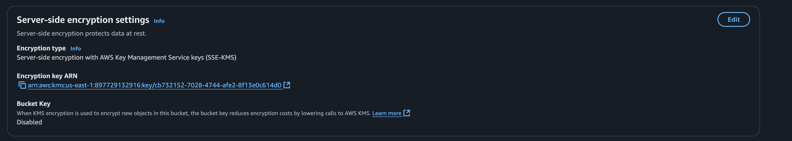
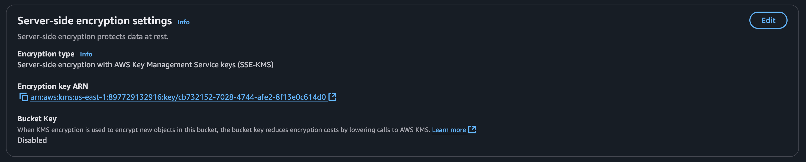

# Deploy and Manage AWS S3 Buckets Using Terraform, AWS CLI, and VSCode


This project automates the deployment of two S3 buckets using Terraform. It includes IAM role creation, KMS encryption, versioning, and file operations via AWS CLI.

## 📋 Table of Contents

- [Architecture](#architecture)
- [Prerequisites](#prerequisites)
- [Usage](#usage)
- [Deliverables](#deliverables)
- [Contributing](#contributing)
- [License](#license)

## 🏗 Architecture

Key components:

1. **Two S3 Buckets**: One for initial storage and one for copied files.
2. **IAM Role**: Manages bucket access permissions.
3. **KMS Encryption**: Ensures security of stored data.
4. **Versioning**: Keeps track of file updates.

## 🛠 Prerequisites

- [AWS Account](https://aws.amazon.com/free) (Free Tier)
- [AWS CLI](https://aws.amazon.com/cli/) configured
- [Terraform](https://www.terraform.io/downloads) v1.5+
- [Visual Studio Code](https://code.visualstudio.com/)

## 🚀 Usage

### Step 1: Clone the Repository

```bash
git clone https://github.com/your-username/s3-terraform.git
cd s3-terraform
```

### Step 2: Configure AWS and Terraform

1. Copy the example Terraform variables file:

```bash
cp terraform/terraform.tfvars.example terraform/terraform.tfvars
```

2. Update `terraform/terraform.tfvars`:

```hcl
aws_region = "us-east-1"
s3_bucket_name1 = "s3-bucket-tech-onea"
s3_bucket_name2 = "s3-bucket-tech-twob"
kms_key_alias = "alias/my-kms-key"
```

### Step 3: Deploy Infrastructure

```bash
cd terraform
terraform init
terraform plan -out=tfplan
terraform apply tfplan
```

### Step 4: Upload and Copy Files Using AWS CLI

1. Create a test file:

```bash
touch secret.txt
echo "Confidential Data" > secret.txt
```

2. Upload the file to the first bucket:

```bash
aws s3 cp secret.txt s3://s3-bucket-1/secret.txt
```

3. Copy the file to the second bucket:

```bash
aws s3 cp s3://s3-bucket-1/secret.txt s3://s3-bucket-2/secret.txt
```

### 📄 Deliverables

1. **Verify Encryption**: Ensure the file is encrypted in S3:

```bash
aws s3api head-object --bucket s3-bucket-1 --key secret.txt
```

2. **Screenshot of AWS Console Showing Both Buckets**



### 🤝 Contributing
We welcome contributions! Please follow these steps:

1. Fork the repository.
2. Create a new branch ```(git checkout -b feature-branch)```.
3. Commit your changes ```(git commit -m 'Add new feature')```.
4. Push to the branch ```(git push origin feature-branch)```.
5. Create a pull request.
See [CONTRIBUTING.md](CONTRIBUTING.md) for guidelines.

### 📜 License

This project is licensed under the Mozilla Public [License](LICENSE.txt) Version 2.0.

